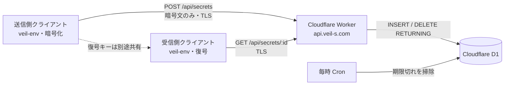

# veil-vault 構成設計

更新日: 2026-10-05  
状態: 初期実装を使った公開前設計。リモートD1の作成、DNS変更、公開、デプロイは未実施。

## 目的と境界

`veil-vault`は、クライアントが暗号化した小さなペイロードを一時保管し、受信側へ一度だけ取り出させるAPIである。暗号鍵はAPIへ送らず、暗号化と復号は信頼できるクライアントが行う。

ここでいう一度だけは、**現在のD1データに対し、競合するGETのうち暗号文を受け取れるものが最大1件**という意味である。削除後の通信断では内容を失う。D1のバックアップやTime Travelからの復元、管理者によるレコードの再投入をまたぐ一度限りの配信や、受信・復号の完了は保証しない。D1からの削除は物理媒体からの完全消去を意味しない。

## 採用する構成



| 部分 | 方針 |
| --- | --- |
| 親ドメイン | 取得済みの`veil-s.com`。アカウント画面で登録状態がActiveであることを確認済み。 |
| APIホスト | `api.veil-s.com`。`veil-vault`専用のCloudflare Worker Custom Domainにする。 |
| Worker | 現在のRust / `worker`実装。`POST /api/secrets`と`GET /api/secrets/:id`だけを公開する。 |
| データストア | D1の`secrets`テーブル。UUID v4、暗号文のUTF-8文字列、UTC Unix秒の作成時刻を保存する。 |
| 保持期限 | 24時間。GET時にも期限を判定し、期限切れは内容を返さず消費する。Cronは毎時、未取得の期限切れレコードを掃除する。 |
| キャッシュ | Worker Cache APIを使わない。すべてのAPI応答に`Cache-Control: no-store`を付ける。 |

Root (`veil-s.com`) は将来の案内・ドキュメント用として予約し、APIホストと混ぜない。専用APIホストでは、そのホスト宛ての全パスがWorkerへ届くため、Workerは未定義パスを404で拒否する。`workers.dev`とプレビューURLは現在の`wrangler.toml`どおり無効のままにする。

## ドメインとWorkerの接続

Workerがホスト上の全リクエストを処理するため、**Worker Custom Domain**を使う。既存オリジンの前段へパス単位で置くWorker Routeは使わない。Routeには別途プロキシ済みDNSレコードが必要になる一方、Custom DomainはWorkerをオリジンとして扱い、DNSレコードとTLS証明書をCloudflareが設定する。

Custom Domainの作成には、Cloudflare上で有効なZoneとWorkerの両方が必要である。**ドメイン登録がActiveであることだけでは、Zoneが有効であることや権威ネームサーバーの委任が完了していることを確認できない。** まずCloudflareのダッシュボードで`veil-s.com`のZoneとネームサーバーを確認する。既存CNAMEがあるホストにはCustom Domainを重ねられないため、`api.veil-s.com`のレコードも確認する。既存レコードの削除や置き換えが必要なら、内容と影響を確認してから別途判断する。

Zoneとホスト名を確認後、Custom DomainをWorkerへ設定する。構成コードで表す場合は次の形にする。追加はまだ行っていない。

```toml
[[routes]]
pattern = "api.veil-s.com"
custom_domain = true
```

API利用時のURLは次の形になる。

```text
https://api.veil-s.com/api/secrets
https://api.veil-s.com/api/secrets/<uuid-v4>
```

CloudflareのCustom Domainは、DNS登録やTLS証明書発行を行うアカウント状態に依存する。公開DNSを変更したり、Workerをデプロイしたりする前に、ダッシュボードのZone状態、既存レコード、Custom Domain追加時に表示される差分を確認する。

## 保存と取得

POSTは最大65,536バイトのUTF-8テキストを受け付け、UUID v4を発行してD1へ保存する。作成時刻はD1の`unixepoch()`で記録する。GETはSELECTとDELETEを別々に行わず、単一の`DELETE … RETURNING`文で取得と削除を行う。期限切れのペイロードは返さず、存在しないID・取得済みID・期限切れIDを同じ404で扱う。

削除エラーは内部情報を返さず500にする。GETの自動再試行は行わない。D1の書き込みはPrimaryで処理されるため、この処理をD1の読み取りレプリカへ振り分けない。初期実装は上限サイズを設定しているが、外部からの作成を絞る認証やレート制限、利用者別クォータはまだない。

## 暗号化とクライアント契約

Workerは暗号方式や鍵を解釈しない。E2EEと呼べるのは、送信クライアントが平文を認証付き暗号化し、鍵をAPIへ送らず、受信クライアントが正しく復号する場合に限る。

`veil-env`との実装接続前に、両側が一致するバージョン付き暗号文フォーマット、AEAD方式、nonce生成、認証タグ、エンコーディング、鍵の生成・受け渡し・消去を決める。現行API上限は**暗号文のUTF-8表現全体で64 KiB**であり、Base64を使う場合は元の暗号文データをこの上限より小さくする必要がある。鍵や秘密情報をシェル引数、環境変数、URL、エラーメッセージ、ログへ不用意に置かない。

GETは消費操作である。URLをリンクプレビュー、セキュリティスキャナー、ブラウザーの先読みへ渡すと、それらのGETが先に消費し得る。初期の公式クライアントは明示的にGETするCLIとし、一般の閲覧リンクやウェブ共有画面は暗号文フォーマットとクライアントの信頼境界を別に設計してから追加する。UUIDは取得権限を持つBearer IDでもあるので、復号キーがなくてもIDを得た第三者が受信機会を消費できる。

## 運用上の制限

- 匿名のPOSTを公開すると、第三者が保管量・D1書き込み枠を消費できる。一般公開前に、利用者認証または適切なレート制限、監視、乱用時の停止方法を決める。
- 取得の一度限りは現在のD1状態に対する保証であり、管理者の復元操作は既取得データを戻す可能性がある。運用手順で復元を承認制にし、復元後に未期限切れレコードを扱う方針を決める。
- アプリケーションはペイロード、鍵、D1例外詳細を自分でログ出力しない。Cloudflare側のリクエストログ、利用状況、保持期間、アカウント設定は別途確認する。
- Free Tier内の運用を保証しない。Worker、D1、保存量、ログ、レート制限の最新料金と利用枠をアカウント状態に合わせて確認する。
- `veil-env`との鍵交換・暗号文互換性、公開APIの認証と乱用対策、障害時の通知は未実装・未確定である。

## 公開までの段階と停止条件

1. **Zone確認:** `veil-s.com`が有効なCloudflare Zoneで、ネームサーバー委任が完了し、`api.veil-s.com`に競合レコードがないことを確認する。
2. **サービス構成:** リモートD1を作成し、本番バインディングIDとスキーマを用意する。D1 IDはローカルのプレースホルダーから本番の値へ切り替える。API認証・レート制限と不正利用の停止策を決める。
3. **Custom Domain:** `api.veil-s.com`を対象WorkerのCustom Domainとして設定し、証明書が有効で、未定義パスが404になることを確認する。
4. **クライアント接続:** 暗号文フォーマットと鍵の受け渡し方式を確定し、`veil-env`で送信、受信、期限切れ、取得済み、通信切断後の再送挙動を確認する。
5. **公開判断:** Cloudflareの利用量・費用・ログ設定を確認し、運用者が監視と乱用停止を引き受けられることを確認する。

段階2以降はリモート状態や請求に影響する。構成レビュー、リモートDB作成・スキーマ適用、DNS/Custom Domain設定、公開デプロイはそれぞれ変更内容を提示してから進める。料金またはゾーン状態が不明、暗号文・鍵の契約が未確定、乱用への停止方法がない場合は公開を保留する。

## 公式資料

- [Workers Custom Domains](https://developers.cloudflare.com/workers/configuration/routing/custom-domains/): ZoneとWorkerの前提、DNS・証明書の自動設定、既存CNAMEとの競合。
- [Workers RoutesとCustom Domains](https://developers.cloudflare.com/workers/configuration/routing/routes/): Workerがオリジンの場合はCustom Domainを使う。
- [D1 PrimaryとRead Replication](https://developers.cloudflare.com/d1/best-practices/read-replication/): 読み取りレプリカは非同期複製で、書き込みはPrimaryへ送られる。
- [D1 Time Travel](https://developers.cloudflare.com/d1/reference/time-travel/): 復元できる期間と運用上の影響。
- [D1料金](https://developers.cloudflare.com/d1/platform/pricing/): Free/Paid利用枠と課金の確認。
